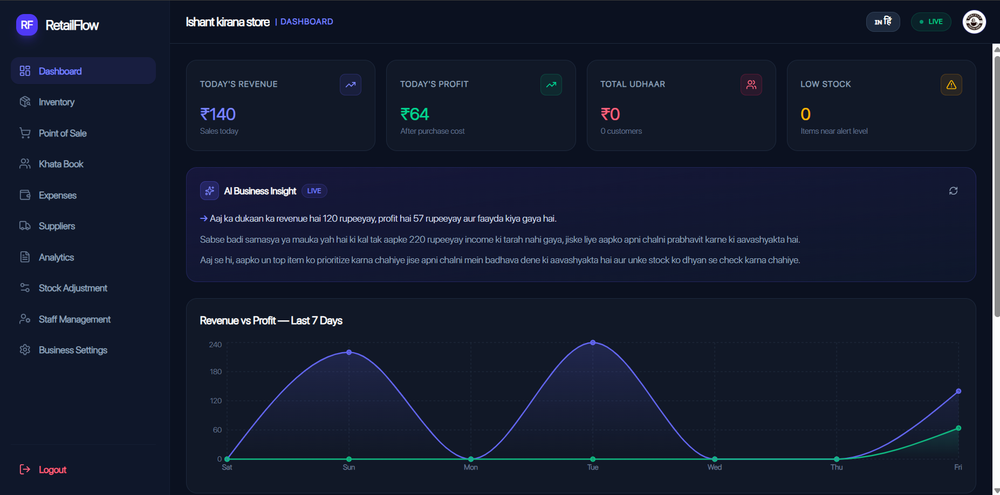
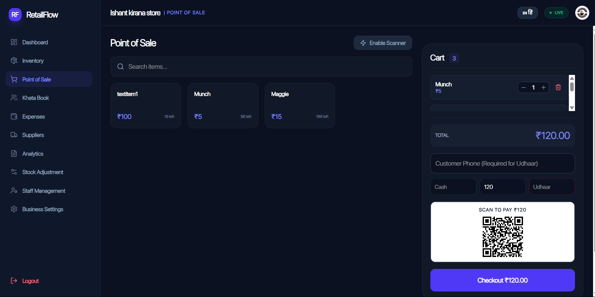
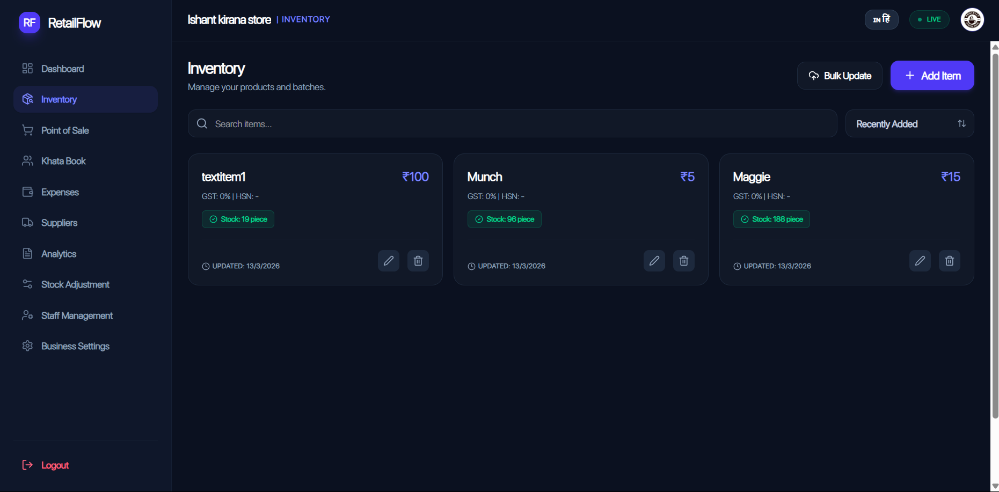
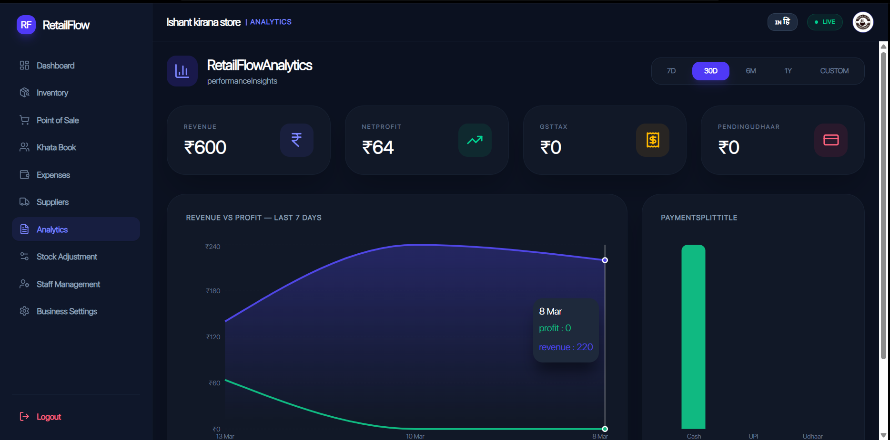

🛍️ RetailFlow
AI-Powered Retail Management SaaS

RetailFlow is a modern SaaS platform for retail store management designed to help small shop owners digitize their business operations.
It combines POS billing, inventory management, khata book, supplier tracking, analytics, and AI insights into one powerful system.

🌍 Live Demo

🔗 Frontend:
https://retail-flow-xi.vercel.app/

🔗 Backend API:
https://retailflow.onrender.com

## 📸 Screenshots

### Dashboard

### POS Billing

### Inventory Management

### Analytics

🧠 Core Features
🛒 POS Billing

Product search and cart system

Quantity management

Payment split (Cash / UPI / Udhaar)

PDF invoice generation

Dynamic UPI QR generation

📦 Inventory Management

Add / edit / delete products

Batch tracking

Expiry date monitoring

Low stock alerts

Category filtering

📒 Khata Book

Customer credit tracking

Payment history

WhatsApp reminders

PDF statement generation

💰 Expense Tracker

Record expenses

Category filtering

Payment method tracking

Date range analysis

👨‍💼 Staff Management

Role based permissions

Staff PIN login

Active / inactive control

📊 Reports & Analytics

Revenue vs profit charts

Payment method breakdown

Category sales analysis

🤖 AI Business Insights

Shop performance analysis

AI generated recommendations

Groq API powered insights

Smart caching

## 🏗️ System Architecture

          ┌─────────────────────────┐
          │        Frontend         │
          │     React + Tailwind    │
          └───────────┬─────────────┘
                      │
                      │ REST API
                      │
          ┌───────────▼─────────────┐
          │         Backend         │
          │      Node + Express     │
          └───────────┬─────────────┘
                      │
        ┌─────────────┼─────────────┐
        │             │             │
 ┌──────▼─────┐ ┌─────▼─────┐ ┌─────▼─────┐
 │   MongoDB  │ │  ImageKit │ │  Groq AI  │
 │  Database  │ │  CDN      │ │ AI Engine │
 └────────────┘ └───────────┘ └───────────┘

⚙️ Tech Stack
🎨 Frontend

React

TailwindCSS

Axios

Recharts

i18next

🧠 Backend

Node.js

Express.js

MongoDB Atlas

JWT Authentication

bcrypt

🔐 Authentication System

RetailFlow supports secure multi-role authentication.

Features:

Owner password login

OTP login

Forgot password

Password reset

Staff PIN login

JWT authentication

Role based access

Roles supported:

Owner

Manager

Cashier

🛡️ Security

Security features implemented:

bcrypt password hashing

bcrypt OTP hashing

JWT authentication

Helmet middleware

API rate limiting

.env excluded from Git

🚀 Deployment

| Service       | Platform      |
| ------------- | ------------- |
| Frontend      | Vercel        |
| Backend       | Render        |
| Database      | MongoDB Atlas |
| Image Storage | ImageKit      |
| AI Service    | Groq API      |

📦 Installation

Clone the repository

git clone https://github.com/yourusername/retailflow.git

Install dependencies

npm install

Run backend

npm run dev

Run frontend

npm start

🔮 Future Improvements

Multi shop support

Mobile app

Barcode scanner

GST automation

Offline POS

Cloud backup

👨‍💻 Author

Ishant Singh
Computer Science Student
Full Stack Developer

⭐ Support

If you like this project, please give it a star ⭐ on GitHub.
